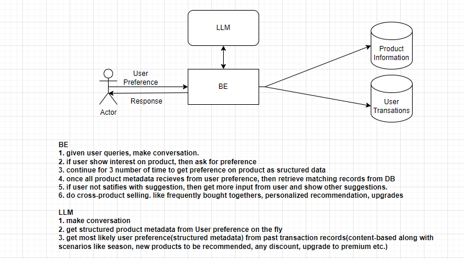
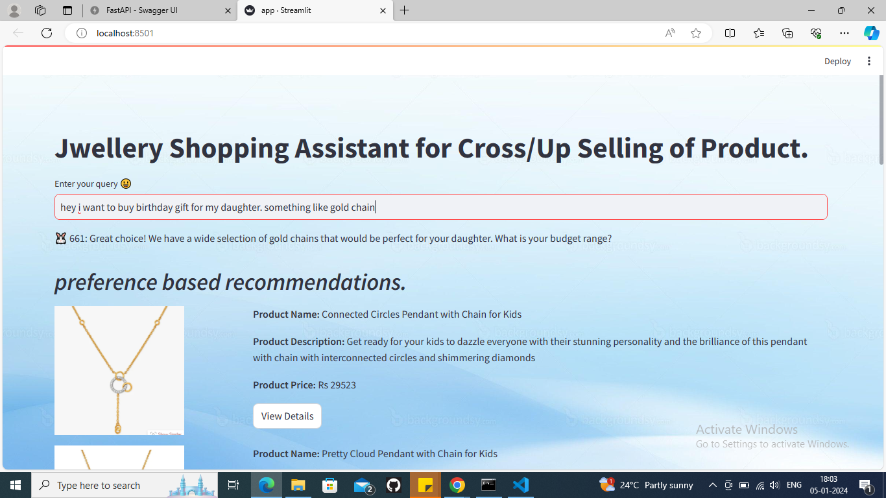
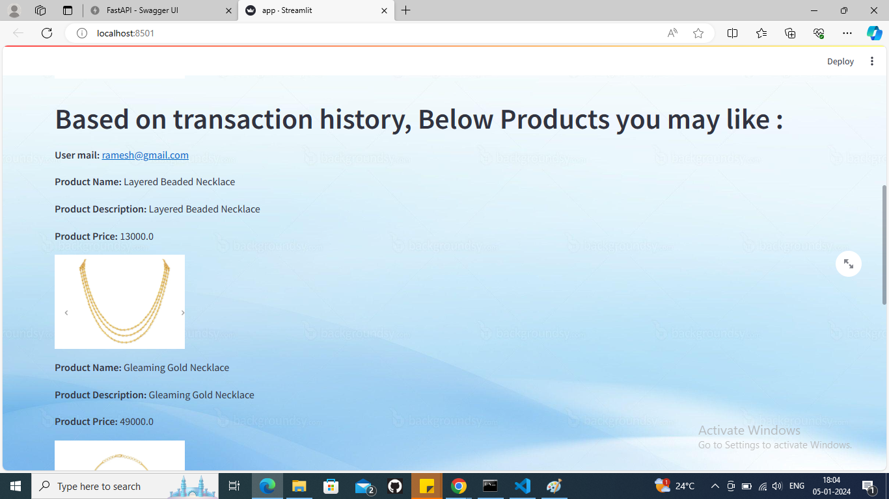
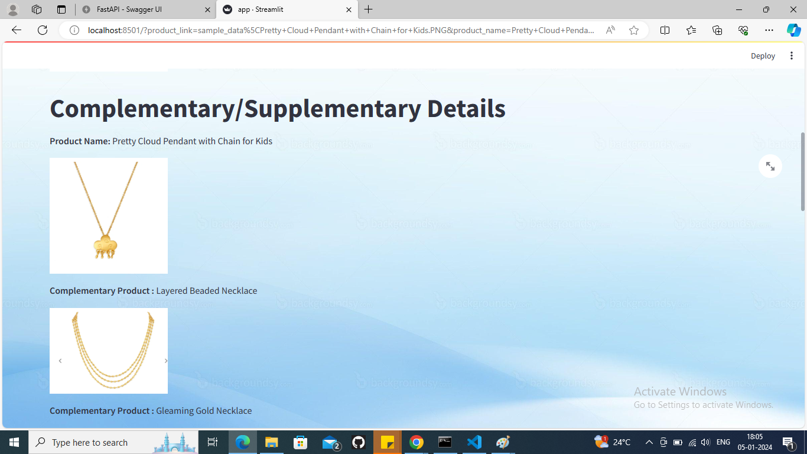

# Jwellery Shopping Assistant for Cross/Up Selling of Product
* Description
    - this is meant to help both Business(seller) and customers. where a seller encourages customers to purchase additional products or services related to their initial purchase.The idea is to offer complementary or supplementary items that enhance the value of the original purchase. Cross-selling is often used to increase the average transaction value and maximize revenue from each customer.
* Scope
    - User can chat with the Bot.
    - During conversation Bot will do cross-selling of products based on user preference or based on user's past transaction.
    1. Bot will analyze information and returns structured information in below format.
        - preference:
            - gender:
            - product-category:
            - occasion:
            - metal:
            - etc.
    2. Recommends best products based on preference
    3. Do cross-selling(preference-based, complementary or supplementary) of products
    4. DO up-selling of products(similar to initial product but with high price. of course due to better features)
* Solution Flow

* Approach
    1. get sample data of products(image,meta data, text description..etc) from tanishq (DONE)
    2. use persona based recommendation(given user's preference, like, dislike, interest.. can come from user by taking input during conversation) (DONE)
    3. if user don't like then show other recommendation till some extent. then give up saying "let me connect you with our human agent for more help!" (TOBE DONE)
    4. cross-selling & up-selling of products when user buys initial product or visits single product page. (DONE)
    5. capture conversation information (TOBE DONE)
## Pre-requisites
* Install python
* Setup Python virtual environment, activate it.
* Install dependency packages using `pip install -r requirements.txt`
* Configure application using `config.yaml`

## Usage
* Setup Rest Service
    - run `uvicorn main:app --port 8002`
* Setup Streamlit Service
    - run `streamlit run app.py`

## Sample UI result

## LICENSE
* General Public Usage :)

## Future Work
    - add DB to log user transactions
    - add cross-selling functionalities in scalable manner
    - sign-up/sign-in page
    - thinking..